# Ncoreflix

This is a simple project that helps you download files from nCore. The goal is to make it as easy to use and as feature-full as common streaming providers.

## Screenshots

<details>
<summary>Mobile screenshots</summary>
    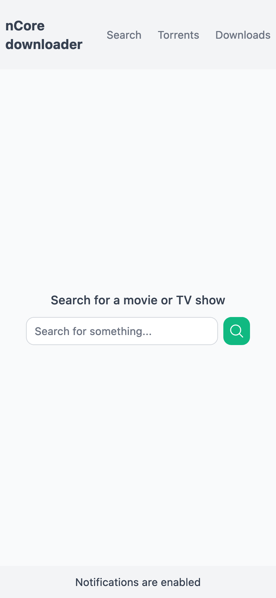
    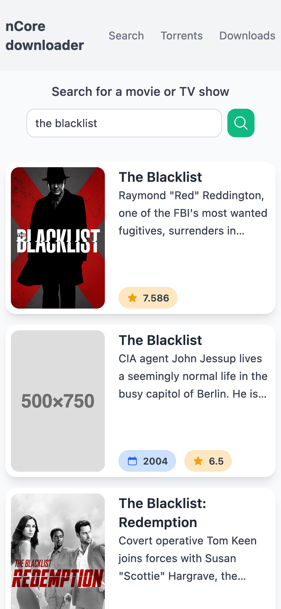
    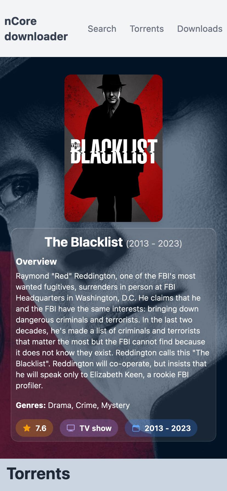
    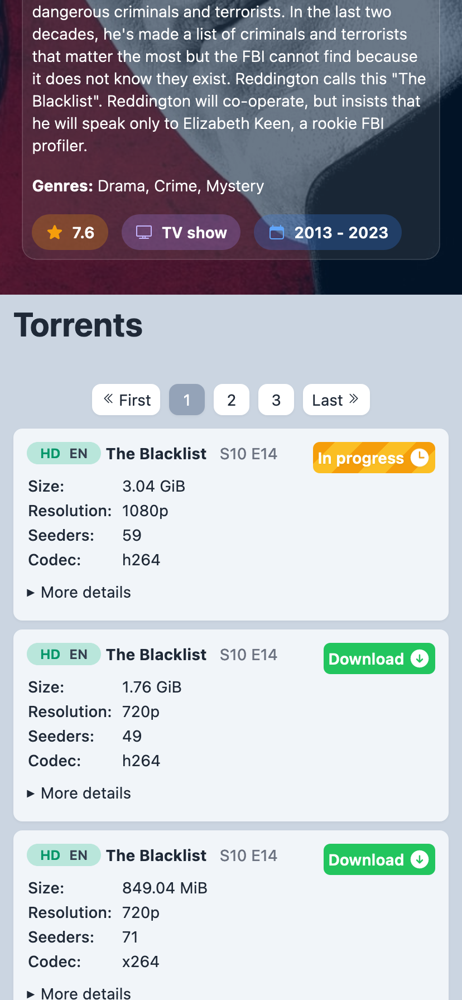
    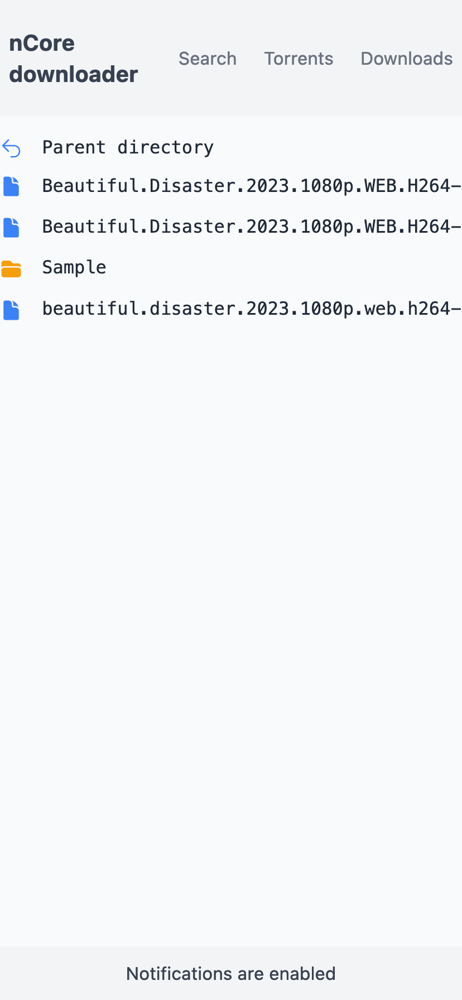
    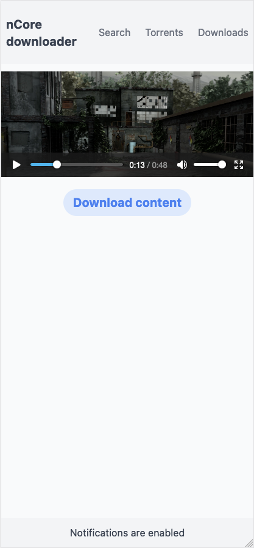
</details>

<details open>
<summary>Desktop screenshots</summary>
    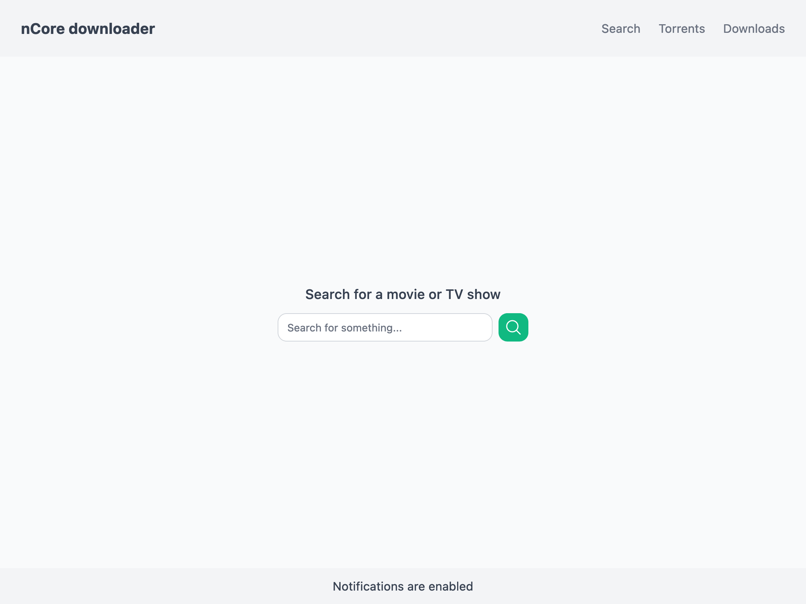
    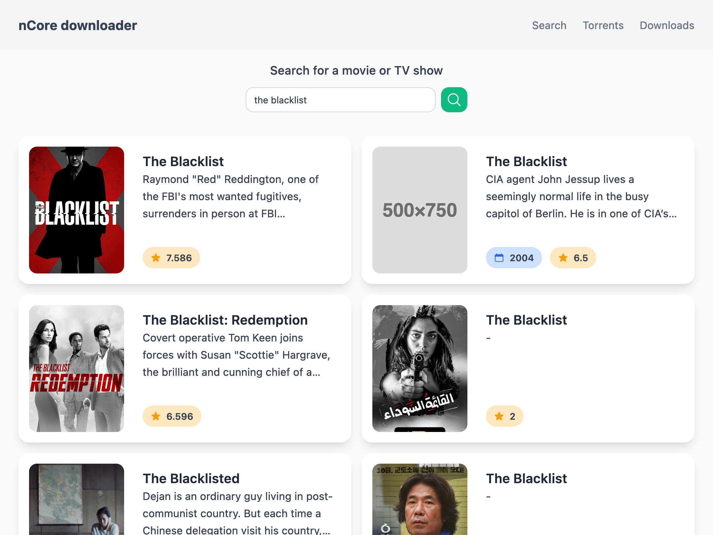
    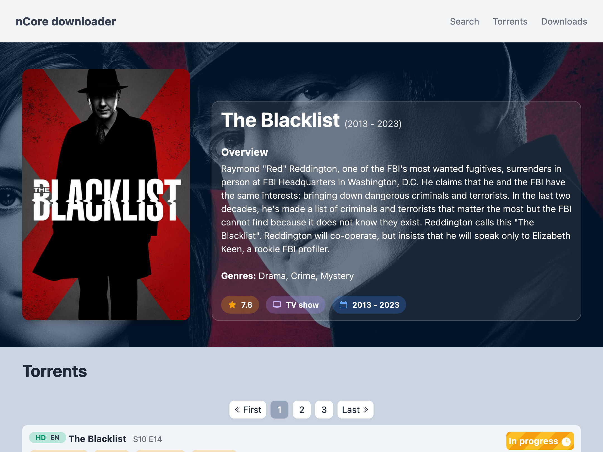
    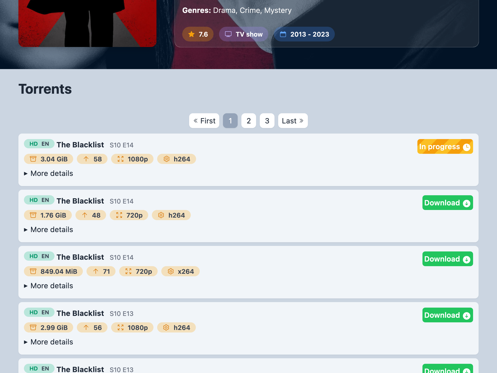
    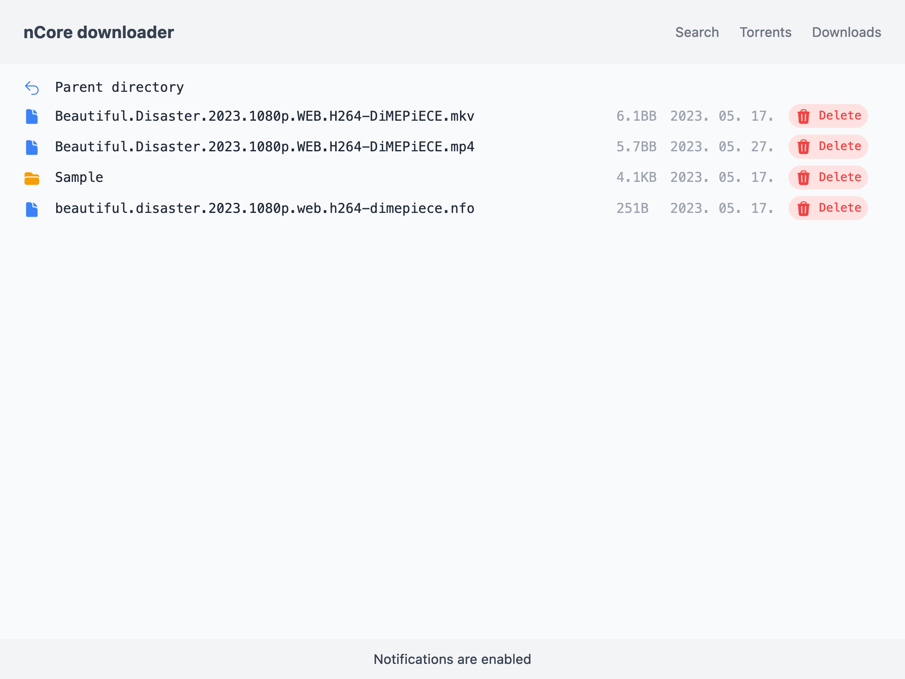
    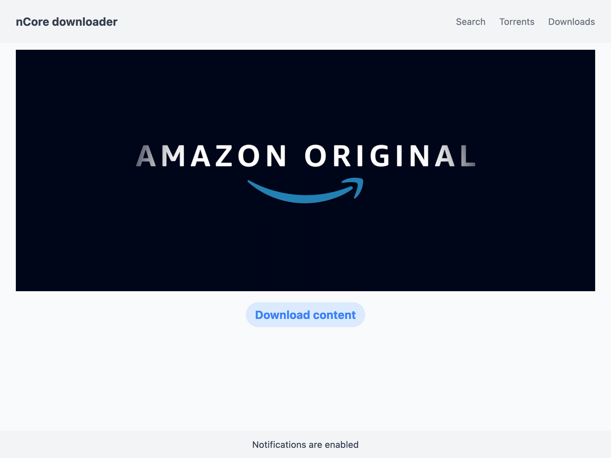
</details>

## Features

-   Movie / TV show search Web UI - with data from [TMDB API](https://developer.themoviedb.org)
    -   This product uses the TMDB API but is not endorsed or certified by TMDB.
-   Downloading the selected torrents with Transmission
-   PWA
    -   This application is a Progressive Web App, which means you can add it to the home screen of your smartphone (iOS supported as well).
    -   Optional Push notifications on your phone when a file is downloaded and when the file is converted to a web-friendly video format.
    -   Responsive layout.
-   File browser - the included file browser web interface lets you browse / delete your downloads. You can also watch the videos in the web browser.
-   FFMPEG conversion of your downloaded videos for web compatibility.

## Setup

Prerequisites: Node.js, NPM, Docker, Docker compose

1. Clone the repository to your machine.
2. Create a `.env.prod` file in the root of the project (`.env` in case you would like to open the app in development mode).
3. Fill the `.env.prod` file the following way:

```bash
NCORE_USERNAME=username # Your nCore login username
NCORE_PASSWORD=password # Your nCore login password
TMDB_TOKEN=abc123 # Your TMDB Access Token
TRANSMISSION_USERNAME=user # the username that you want to use for Transmission
TRANSMISSION_PASSWORD=password # the username that you want to use for Transmission
TRANSMISSION_DOWNLOAD_DIR=/downloads # Where you want to download things (absolute path)
ASTROAUTH_SECRET=randomString123 # A secret for hashing passwords
AUTH_PASSWORD=password # the password for this site
PUBLIC_VAPID_PUBLIC_KEY=generated_public_vapid_key # generated public VAPID key
VAPID_PRIVATE_KEY=generated_private_vapid_key # generated private VAPID key


# === You don't need to change the variables below
PORT=3000
NCORE_URL=https://ncore.pro
TMDB_API_URL=https://api.themoviedb.org
INTERNAL_TRANSMISSION_PORT=4100
PUBLIC_TRANSMISSION_PORT=4100
ASTROAUTH_URL=localhost:3000
EXTRACT_SUBTITLES_FROM_MKV=true
DOCKER_WORKDIR=/app
DOCKER_START_COMMAND='npm run start'
TRANSMISSION_PEER_PORT=51413
DOCKER_NODE_ENV=production

```

4. Run `npm run docker:prod`
5. Your website should be available on the set port in localhost.

### How to generate the necessary variables?

#### TMDB_TOKEN

Sign up for a free TMDB account [here](https://www.themoviedb.org/signup).

Follow the instructions in [this FAQ](https://developer.themoviedb.org/docs/faq).

#### ASTROAUTH_SECRET

You can pick a random secret from [this site](https://randomkeygen.com/#504_wpa)

#### `PUBLIC_VAPID_PUBLIC_KEY` and `VAPID_PRIVATE_KEY`

This command generates a key-pair for you:

```sh
npx web-push generate-vapid-keys
```

---

### DEV mode - if you are looking to contribute

Setting up the app in development mode is really similar to setting it up for prod. Here are the differences you need to make:

1. Change the following environment variables:

```bash
DOCKER_NODE_ENV=development
DOCKER_START_COMMAND='npm run dev'
```

2. Run `npm run docker:dev`.
3. Install dependencies locally: `npm install`
